<center>

# Cat 智能BI平台


<div style="display: flex; justify-content: center;">
    
    
    
</div>

<div>
    
    
    
</div>

<div>
    
    
    
    
</div>

</center>


> 作者：🐈[猫十二懿](https://github.com/kongshier)

## 项目介绍 📢
本项目是基于React+Spring Boot+RabbitMQ+AIGC的智能BI数据分析平台。

访问地址：http://bi.kongshier.top

来源自[编程导航](https://yupi.icu)
> AIGC ：Artificial Intelligence Generation Content(AI 生成内容)

区别于传统的BI，数据分析者只需要导入最原始的数据集，输入想要进行分析的目标，就能利用AI自动生成一个符合要求的图表以及分析结论。此外，还会有图表管理、异步生成、AI对话等功能。只需输入分析目标、原始数据和原始问题，利用AI就能一键生成可视化图表、分析结论和问题解答，大幅降低人工数据分析成本。

## 项目功能 🎊
### 已有功能
1. 用户登录
2. 智能分析（同步）。调用AI根据用户上传csv文件生成对应的 JSON 数据，并使用 ECharts图表 将分析结果可视化展示
3. 智能分析（异步）。使用了线程池异步生成图表，最后将线程池改造成使用 RabbitMQ消息队列 保证消息的可靠性，实现消息重试机制
4. 用户限流。本项目使用到令牌桶限流算法，使用Redisson实现简单且高效分布式限流，限制用户每秒只能调用一次数据分析接口，防止用户恶意占用系统资源
5. 调用AI进行数据分析，并控制AI的输出
6. 由于AIGC的输入 Token 限制，使用 Easy Excel 解析用户上传的 XLSX 表格数据文件并压缩为CSV，实测提高了20%的单次输入数据量、并节约了成本。
7. 后端自定义 Prompt 预设模板并封装用户输入的数据和分析诉求，通过对接 AIGC 接口生成可视化图表 JSON 配置和分析结论，返回给前端渲染。
### 新增功能
1. 新增用户注册功能
2. 新增用户调用次数表，用户注册同时完成插入次数表，当使用AI生成接口时分布式锁对使用次数锁定，次数扣减才释放锁
3. 新增删除图表/对话结果功能
4. 新增死信队列，将处理图表的队列绑定到死信队列上，保证消息可靠性，若分析失败，则进入死信，将补偿用户次数
5. 添加支付宝沙箱支付功能，下单充值AI使用次数完成，使用沙箱进行支付，完成支付功能，支付完成得到对应的使用次数
6. 新增延迟队列，当下单完成10分钟，还没有支付订单，则会标记为超时订单
7. 新增用户上传头像功能，使用阿里云对象存储OSS存储图片
8. 修改前端登录/注册界面
9. 优化前端显示，效果如下展示
10. 用户查看原始数据
11. 新增AI对话，用户提交问题，AI分析解答

## 项目背景 📖
1.基于AI快速发展的时代，AI + 程序员 = 无限可能。
2. 传统数据分析流程繁琐：传统的数据分析过程需要经历繁琐的数据处理和可视化操作，耗时且复杂。
3. 技术要求高：传统数据分析需要数据分析者具备一定的技术和专业知识，限制了非专业人士的参与。
4. 人工成本高：传统数据分析需要大量的人力投入，成本昂贵。
5. AI自动生成图表和分析结论：该项目利用AI技术，只需导入原始数据和输入分析目标，即可自动生成符合要求的图表和分析结论。
6. 提高效率降低成本：通过项目的应用，能够大幅降低人工数据分析成本，提高数据分析的效率和准确性。


## 项目核心亮点 ⭐
1. 自动化分析：通过AI技术，将传统繁琐的数据处理和可视化操作自动化，使得数据分析过程更加高效、快速和准确。
2. 一键生成：只需要导入原始数据集和输入分析目标，系统即可自动生成符合要求的可视化图表和分析结论，无需手动进行复杂的操作和计算。
3. 可视化管理：项目提供了图表管理功能，可以对生成的图表进行整理、保存和分享，方便用户进行后续的分析和展示。
4. 异步生成：项目支持异步生成，即使处理大规模数据集也能保持较低的响应时间，提高用户的使用体验和效率。
5. AI对话功能：除了自动生成图表和分析结果，项目还提供了AI对话功能，可以与系统进行交互，进一步解答问题和提供更深入的分析洞察。
6. 智能数据处理：项目通过AI技术实现了智能化的数据处理功能，能够自动识别和处理各种数据类型、格式和缺失值，提高数据的准确性和一致性。
7. 沙箱支付：项目通过沙箱支付模拟真实的支付环境，对AI使用次数进行充值。


## 快速启动 🏃‍♂️
1. 下载/拉取本项目到本地
2. 通过 IDEA 代码编辑器进行打开项目，等待依赖的下载
3. 修改配置文件 `application.yaml` 的信息，比如数据库、Redis、RabbitMQ等
4. 修改信息完成后，通过 `ShierApplication` 程序进行运行项目


### 环境配置（建议）🚞
1. Java Version：1.8.0_371
2. MySQL：8.0.20
3. Redis：5.0.14
4. Erlang：24.2
5. RabbitMQ：3.9.11
6. RabbitMQ延迟队列插件：3.10.0.ez ( 选择一个与RabbitMQ版本兼容的即可)
7. 阿里云对象存储OSS
8. 沙箱支付

## 项目架构图 🔥
### 基础架构
基础架构：客户端输入分析诉求和原始数据，向业务后端发送请求。业务后端利用AI服务处理客户端数据，保持到数据库，并生成图表。处理后的数据由业务后端发送给AI服务，AI服务生成结果并返回给后端，最终将结果返回给客户端展示。


### 优化项目架构-异步化处理
优化流程（异步化）：客户端输入分析诉求和原始数据，向业务后端发送请求。业务后端将请求事件放入消息队列，并为客户端生成取餐号，让要生成图表的客户端去排队，消息队列根据I服务负载情况，定期检查进度，如果AI服务还能处理更多的图表生成请求，就向任务处理模块发送消息。

任务处理模块调用AI服务处理客户端数据，AI 服务异步生成结果返回给后端并保存到数据库，当后端的AI工服务生成完毕后，可以通过向前端发送通知的方式，或者通过业务后端监控数据库中图表生成服务的状态，来确定生成结果是否可用。若生成结果可用，前端即可获取并处理相应的数据，最终将结果返回给客户端展示。在此期间，用户可以去做自己的事情。


## 项目技术栈和特点 ❤️‍🔥
### 后端
1. Spring Boot 2.7.2
2. Spring MVC
3. MyBatis + MyBatis Plus 数据访问（开启分页）
4. Spring Boot 调试工具和项目处理器
5. Spring AOP 切面编程
6. Spring Scheduler 定时任务
7. Spring 事务注解
8. Redis：Redisson限流控制
9. MyBatis-Plus 数据库访问结构
10. IDEA插件 MyBatisX ： 根据数据库表自动生成
11. **RabbitMQ：消息队列**
12. AI SDK：鱼聪明AI接口开发
13. JDK 线程池及异步化
15. Swagger + Knife4j 项目文档
16. Easy Excel：表格数据处理、Hutool工具库 、Apache Common Utils、Gson 解析库、Lombok 注解

### 前端
1. React 18
2. Umi 4 前端框架
3. Ant Design Pro 5.x 脚手架
4. Ant Design 组件库 
5. OpenAPI 代码生成：自动生成后端调用代码（来自鱼聪明开发平台）
6. EChart 图表生成

### 数据存储
- MySQL 数据库
- 阿里云 OSS 对象存储

### 项目特性
- Spring Session Redis 分布式登录
- 全局请求响应拦截器（记录日志）
- 全局异常处理器
- 自定义错误码
- 封装通用响应类
- Swagger + Knife4j 接口文档
- 自定义权限注解 + 全局校验
- 全局跨域处理
- 长整数丢失精度解决
- 多环境配置

### 项目功能
- 用户登录、注册、注销、更新、检索、权限管理、头像上传
- 图表创建、删除、查询、查看愿数据
- AI对话创建、删除、查询
- 订单创建、删除、修改、支付、查询
- 沙箱支付创建、查询
- 使用次数修改、新增、充值

### 单元测试
- JUnit5 单元测试、业务功能单元测试


### 目录结构
```
├─main
│  ├─java
│  │  └─com
│  │      └─shier
│  │          └─shierbi
│  │              │  ShierApplication.java  // 启动类
│  │              │
│  │              ├─annotation              // 权限控制类
│  │              │      AuthCheck.java
│  │              │
│  │              ├─aop                    
│  │              │      AuthInterceptor.java
│  │              │      LogInterceptor.java
│  │              │
│  │              ├─bizmq                  // BI项目MQ配置
│  │              │  │  AiAssistantMq.java
│  │              │  │  AiMqInit.java
│  │              │  │  BiMassageFailConsumer.java
│  │              │  │  BiMqInit.java
│  │              │  │  BiMqMessageConsumer.java
│  │              │  │  BiMqMessageProducer.java
│  │              │  │  RabbitMqInitDemo.java
│  │              │  │  RabbitMqMessageConsumer.java
│  │              │  │  RabbitMqMessageProducer.java
│  │              │  │
│  │              │  └─order   // 订单相关队列
│  │              │          OrderDelayedQueueConfig.java
│  │              │          OrderMessageConsumer.java
│  │              │          OrderMessageProducer.java
│  │              │
│  │              ├─common    // 通用类
│  │              │      BaseResponse.java
│  │              │      DeleteRequest.java
│  │              │      ErrorCode.java
│  │              │      PageRequest.java
│  │              │      ResultUtils.java
│  │              │
│  │              ├─config   // 项目配置类
│  │              │      AiModelConfig.java
│  │              │      AliPayConfig.java
│  │              │      CorsConfig.java
│  │              │      JsonConfig.java
│  │              │      Knife4jConfig.java
│  │              │      MyBatisPlusConfig.java
│  │              │      RabbitMqConfig.java
│  │              │      RedissonConfig.java
│  │              │      ThreadPoolExecutorConfig.java
│  │              │
│  │              ├─constant   // 项目常量类
│  │              │      BiMqConstant.java
│  │              │      ChartConstant.java
│  │              │      CommonConstant.java
│  │              │      FileConstant.java
│  │              │      UserConstant.java
│  │              │
│  │              ├─controller  // 前端请求接口
│  │              │      AiAssistantController.java
│  │              │      AiFrequencyController.java
│  │              │      AiFrequencyOrderController.java
│  │              │      AliPayController.java
│  │              │      AliPayInfoController.java
│  │              │      ChartController.java
│  │              │      FileController.java
│  │              │      QueueController.java
│  │              │      UserController.java
│  │              │
│  │              ├─exception  // 全局异常处理类
│  │              │      BusinessException.java
│  │              │      GlobalExceptionHandler.java
│  │              │      ThrowUtils.java
│  │              │
│  │              ├─manager   // 项目管理类
│  │              │      AiManager.java
│  │              │      RedisLimiterManager.java
│  │              │
│  │              ├─mapper   // 数据访问层（持久层）
│  │              │      AiAssistantMapper.java
│  │              │      AiFrequencyMapper.java
│  │              │      AiFrequencyOrderMapper.java
│  │              │      AlipayInfoMapper.java
│  │              │      ChartMapper.java
│  │              │      UserCodeMapper.java
│  │              │      UserMapper.java
│  │              │
│  │              ├─model  // 项目实体类
│  │              │  ├─dto
│  │              │  │  ├─aiassistant  // ai 助手请求实体封装类
│  │              │  │  │      AiAssistantAddRequest.java
│  │              │  │  │      AiAssistantEditRequest.java
│  │              │  │  │      AiAssistantQueryRequest.java
│  │              │  │  │      AiAssistantUpdateRequest.java
│  │              │  │  │      GenChatByAiRequest.java
│  │              │  │  │
│  │              │  │  ├─alipayinfo  // 支付请求实体封装类
│  │              │  │  │      AlipayInfoQueryRequest.java
│  │              │  │  │
│  │              │  │  ├─chart       // 图表请求实体封装类
│  │              │  │  │      ChartAddRequest.java
│  │              │  │  │      ChartEditRequest.java
│  │              │  │  │      ChartQueryRequest.java
│  │              │  │  │      ChartUpdateRequest.java
│  │              │  │  │      GenChartByAiRequest.java
│  │              │  │  │ 
│  │              │  │  ├─file      // 文件请求实体封装类
│  │              │  │  │      UploadFileRequest.java
│  │              │  │  │
│  │              │  │  ├─frequency // 次数请求实体封装类
│  │              │  │  │      FrequencyRequest.java
│  │              │  │  │
│  │              │  │  ├─order     // 订单请求实体封装类
│  │              │  │  │      AiFrequencyOrderCancelRequest.java
│  │              │  │  │      AiFrequencyOrderQueryRequest.java
│  │              │  │  │      AiFrequencyOrderUpdateRequest.java
│  │              │  │  │
│  │              │  │  └─user     // 用户请求实体封装类
│  │              │  │          UserAddRequest.java
│  │              │  │          UserLoginRequest.java
│  │              │  │          UserQueryRequest.java
│  │              │  │          UserRegisterRequest.java
│  │              │  │          UserUpdateMyRequest.java
│  │              │  │          UserUpdateRequest.java
│  │              │  │
│  │              │  ├─entity    // 实体信息类
│  │              │  │      AiAssistant.java
│  │              │  │      AiFrequency.java
│  │              │  │      AiFrequencyOrder.java
│  │              │  │      AlipayInfo.java
│  │              │  │      Chart.java
│  │              │  │      User.java
│  │              │  │      UserCode.java
│  │              │  │ 
│  │              │  ├─enums    // 枚举类
│  │              │  │      AiAssistantStatusEnum.java
│  │              │  │      ChartStatusEnum.java
│  │              │  │      FileUploadBizEnum.java
│  │              │  │      PayOrderEnum.java
│  │              │  │      UserRoleEnum.java
│  │              │  │      UserStatusEnum.java
│  │              │  │
│  │              │  └─vo    // 返回数据封装类
│  │              │          AiFrequencyOrderVO.java
│  │              │          AiFrequencyVO.java
│  │              │          AlipayInfoVO.java
│  │              │          BiResponse.java
│  │              │          LoginUserVO.java
│  │              │          PayInfoVO.java
│  │              │          UserCodeVO.java
│  │              │          UserVO.java
│  │              │
│  │              ├─mq     // mq测试类
│  │              │      DirectConsumer.java
│  │              │      DirectProducer.java
│  │              │      DlxDirectConsumer.java
│  │              │      DlxDirectProducer.java
│  │              │      FanoutConsumer.java
│  │              │      FanoutProducer.java
│  │              │      MultiConsumer.java
│  │              │      MultiProducer.java
│  │              │      SingleConsumer.java
│  │              │      SingleProducer.java
│  │              │      TopicConsumer.java
│  │              │      TopicProducer.java
│  │              │      TtlConsumer.java
│  │              │      TtlProducer.java
│  │              │
│  │              ├─service   // 服务层
│  │              │  │  AiAssistantService.java
│  │              │  │  AiFrequencyOrderService.java
│  │              │  │  AiFrequencyService.java
│  │              │  │  AlipayInfoService.java
│  │              │  │  ChartService.java
│  │              │  │  FileService.java
│  │              │  │  UserCodeService.java
│  │              │  │  UserService.java
│  │              │  │
│  │              │  └─impl  // 服务实现类
│  │              │          AiAssistantServiceImpl.java
│  │              │          AiFrequencyOrderServiceImpl.java
│  │              │          AiFrequencyServiceImpl.java
│  │              │          AlipayInfoServiceImpl.java
│  │              │          ChartServiceImpl.java
│  │              │          FileServiceImpl.java
│  │              │          UserCodeServiceImpl.java
│  │              │          UserServiceImpl.java
│  │              │
│  │              └─utils  // 工具类
│  │                      ChartUtils.java
│  │                      EncryptUtil.java
│  │                      ExcelUtils.java
│  │                      FileUtils.java
│  │                      IdWorkerUtils.java
│  │                      NetUtils.java
│  │                      QRCodeUtil.java
│  │                      SpringContextUtils.java
│  │                      SqlUtils.java
│  │
│  └─resources   // 资源配置类
│      │  application-prod.yml
│      │  application-test.yml
│      │  application.yml
│      │  banner.txt
│      │  测试数据.xlsx
│      │
│      └─mapper
│              AiAssistantMapper.xml
│              AiFrequencyMapper.xml
│              AiFrequencyOrderMapper.xml
│              AlipayInfoMapper.xml
│              ChartMapper.xml
│              UserCodeMapper.xml
│              UserMapper.xml
│
└─test  // 单元测试
    └─java
        └─com
            └─shier
                └─shierbi
                    │  ShierApplicationTests.java
                    │  
                    ├─bizmq
                    │      BiMassageFailConsumerTest.java
                    │      BiMqMessageProducerTest.java
                    │      RabbitMqMessageProducerTest.java
                    │
                    ├─controller
                    │      AliPayControllerTest.java
                    │
                    ├─manager
                    │      AiManagerTest.java
                    │      RedisLimiterManagerTest.java
                    │
                    ├─service
                    │      ChartServiceTest.java
                    │      UserServiceTest.java
                    │
                    └─utils
                            EasyExcelTest.java
```

## BI项目展示
### 用户登录注册


### 项目首页


### 同步分析数据生成图表


### 异步分析数据生成图表


### 图表管理界面
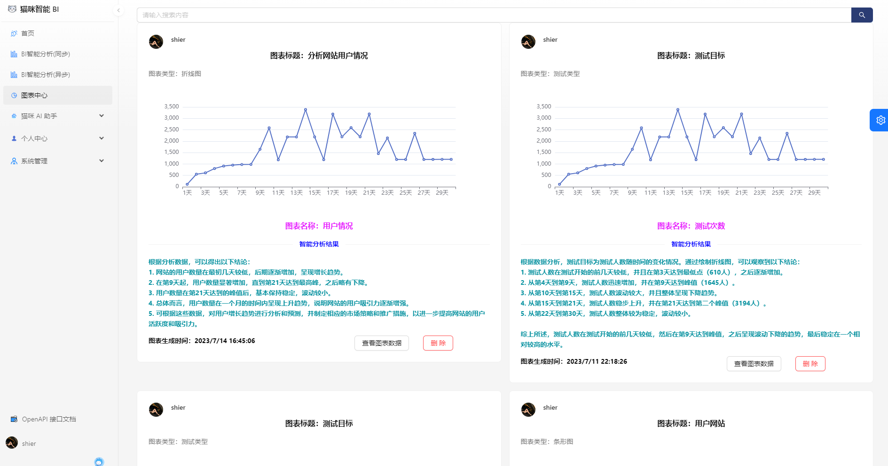
### 查看图表原始数据
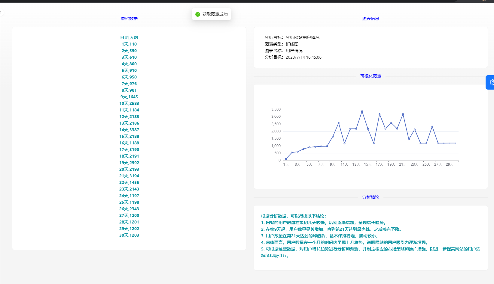

### AI 问答助手


### AI 对话管理


### 个人中心
个人信息，修改信息，点击头像修改头像
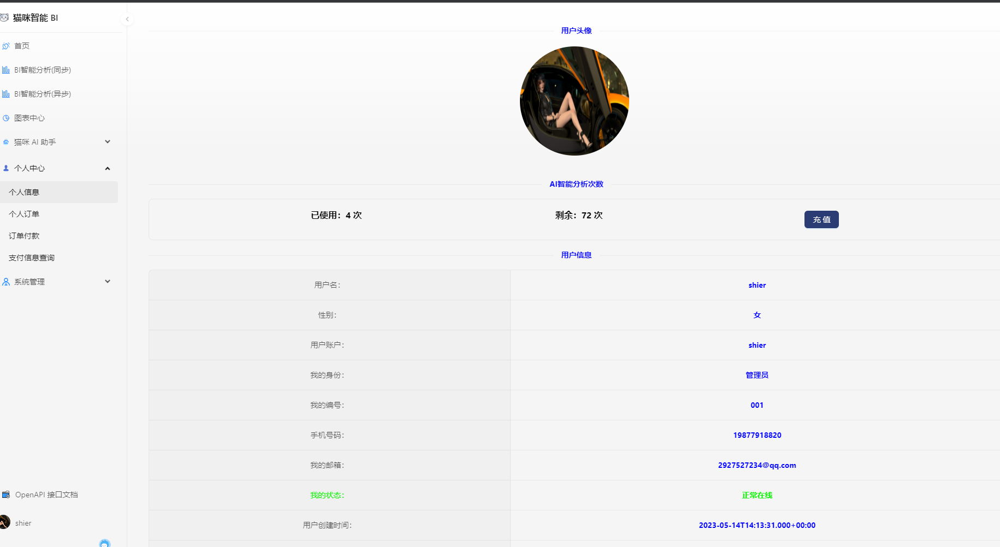

个人订单信息
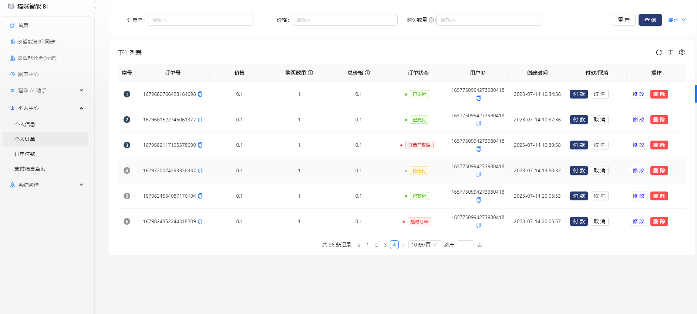

付款订单
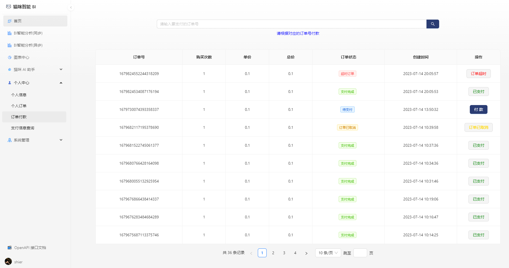

修改购买数量
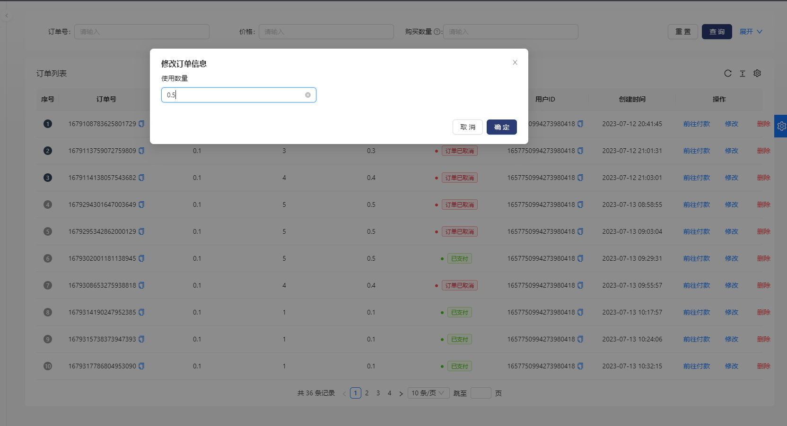

订单交付结果信息查询
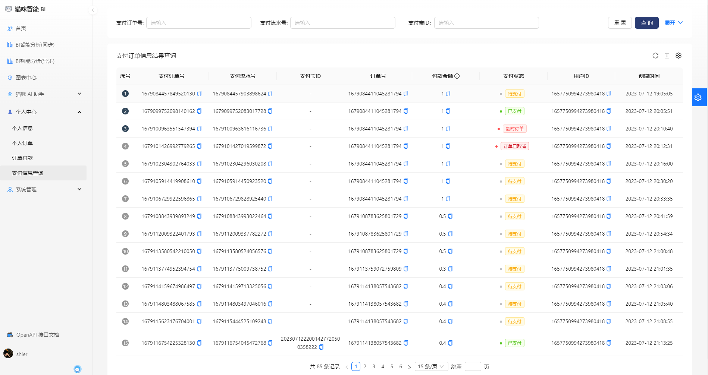

### 管理员功能
管理员介绍
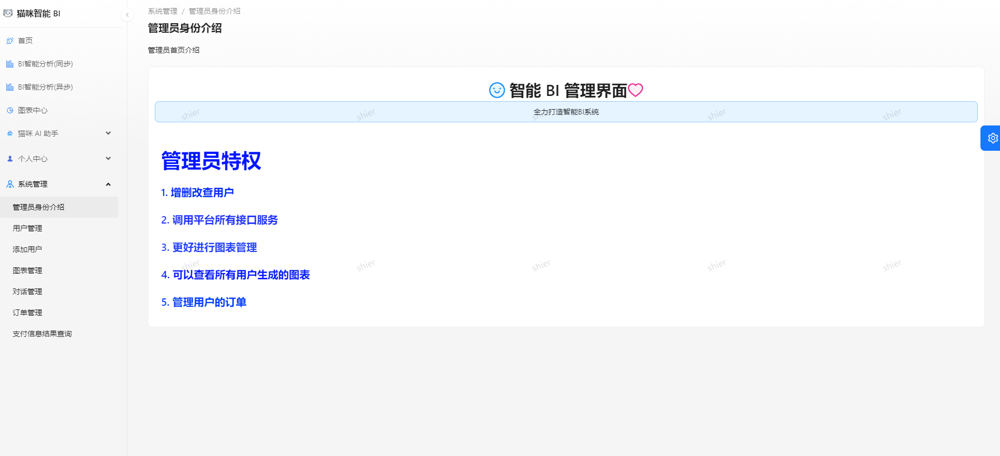

用户管理
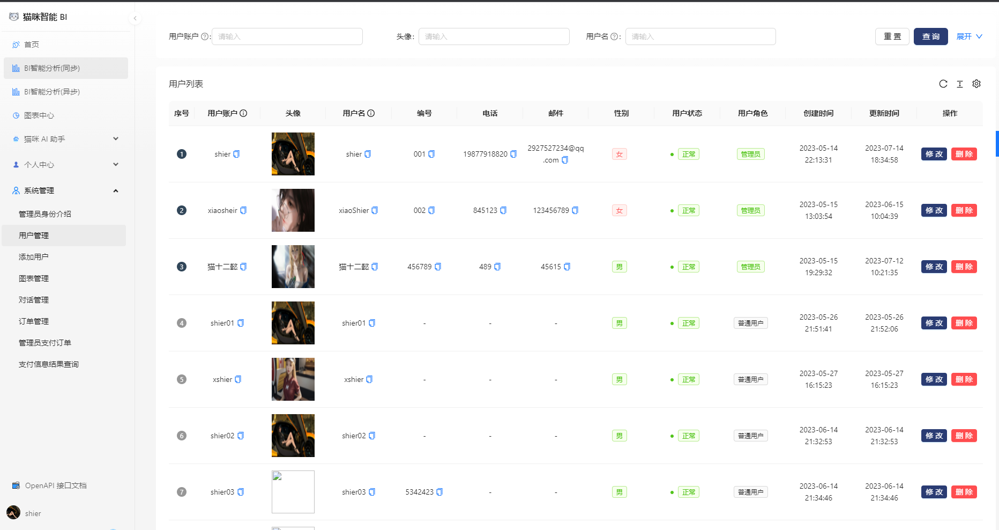

修改用户信息
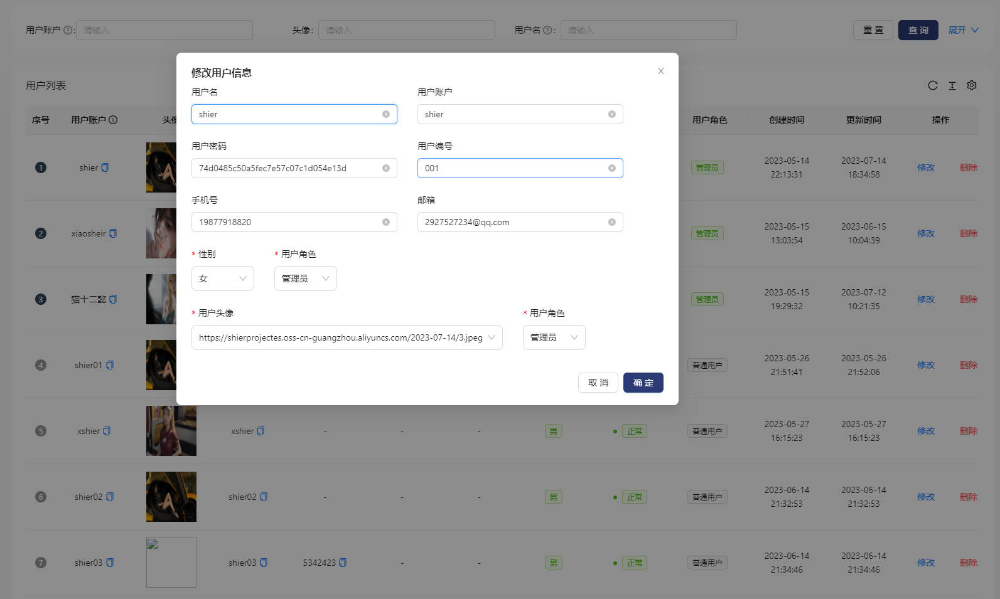

删除用户
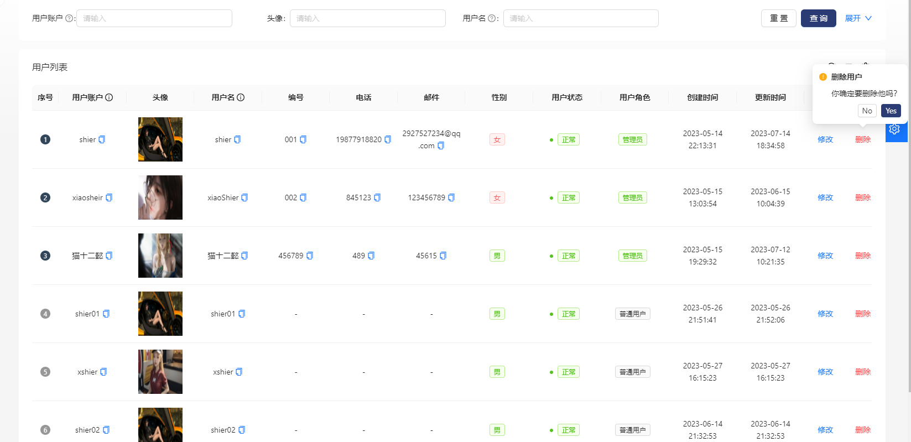

新增用户
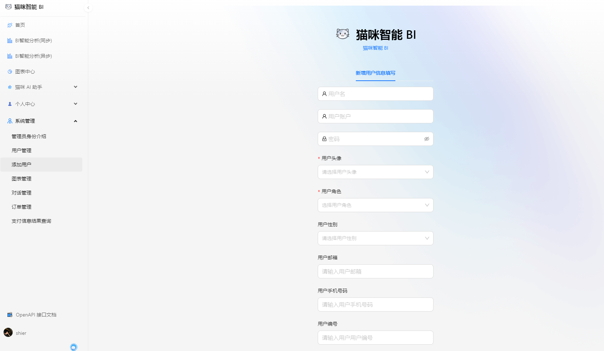

图表管理
查看所有用户的图表信息，查看图表数据、删除图表
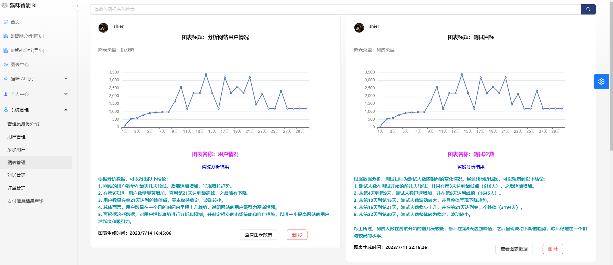

订单管理、支付管理
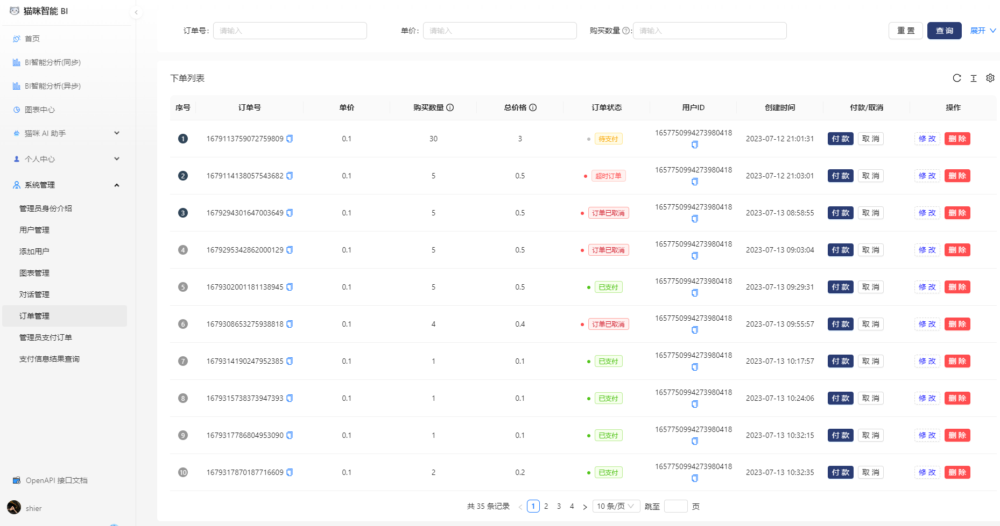
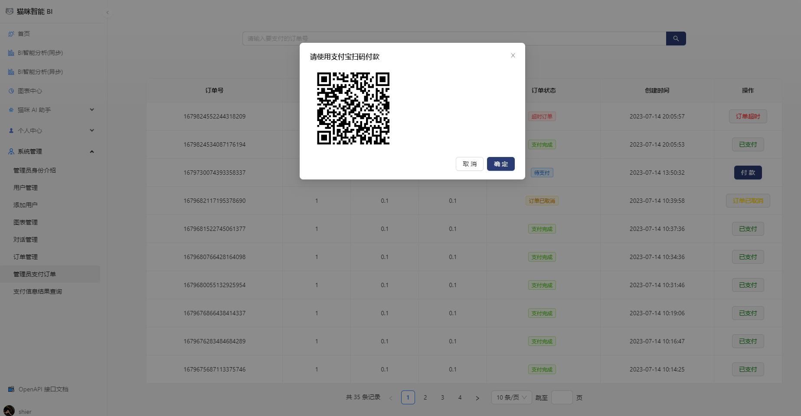

查询交易信息
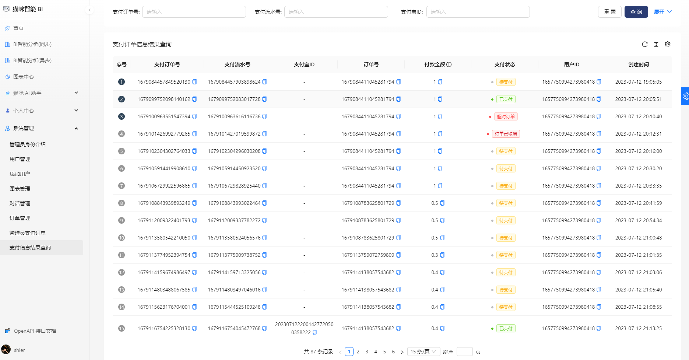

## 项目BUG
- AI生成的内容导致查询图表出现报错，由于AIGC得出的结果不一定是JSON数据，导致前端JSON数据格式解析失败
- 下单了无法支付，目前是使用沙箱环境，只有我手中的沙箱账号才能支付
> 如果发现新的bug 或者存在问题以上问题请联系作者：https://www.yuque.com/kcsshier

## 后续项目改造
- 使用ElasticSearch进行搜索内容，爬取图片、视频等
- 加入广告
- 将项目改造成微服务
